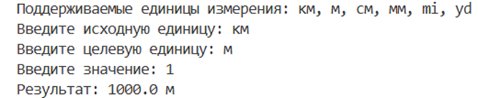
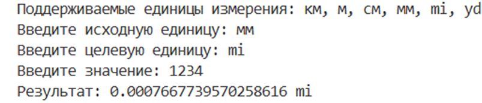

# Лабораторная работа №02 - Github

## Испольнитель
Владимиров Артём \
Группа ФТ-240007

## Содержание
- [Задание №1](#задание-1---нахождение-площади-треугольника-по-формуле-герона)
    - [Инструкция по работе](#инструкция-по-работе)
    - [Результат тестирования](#результат-тестирования)
- [Задание №2](#задание-2---конвертер-единиц-измерения-расстояния)
    - [Инструкция по работе](#инструкция-по-работе-1)
    - [Результат тестирования](#результат-тестирования-1)
- [Задание №3](#задание-3---определение-високосного-года)
    - [Инструкция по работе](#инструкция-по-работе-2)
    - [Результат тестирования](#результат-тестирования-2)
## Среда разработки
Язык программирования: Python. \
Среда разработки: Visual Studio 2019.
# Задание №1 - Нахождение площади треугольника по формуле Герона
Напишите программу, которая вычисляет площадь треугольника по трём его 
сторонам (по формуле Герона) с точность до сотых.
## Инструкция по работе
Необходимо запустить файл ``main.py``, находящийся в каталоге ``/1-exercise``. По запросу программы требуется ввести длины 3-х сторон треугольника, после чего будет автоматически вычисленна его площадь по формуле Герона.
## Результат тестирования

### Тест №1

### Тест №2

### Тест №3

# Задание №2 - Конвертер единиц измерения расстояния
Создайте программу-конвертер, которая переводит расстояние из одних 
единиц измерения в другие. Программа должна поддерживать следующие 
единицы: Километры (км), Метры (м), Сантиметры (см), Миллиметры (мм), 
Мили (mi), Ярды (yd).
## Инструкция по работе
Необходимо запустить файл ``main.py``, находящийся в каталоге ``/2-exercise``. Программа выведет список поддерживаемых единиц измерения расстояния, после чего предложит указать исходную и целевую единицы измерения, а так же само значение для перевода. Результатом работы будет переведенное значение в нужных для вас единицах.
## Результат тестирования

### Тест №1

### Тест №2

### Тест №3

# Задание №3 - Определение високосного года
Напишите программу, которая определяет, является ли введенный год 
високосным.
## Инструкция по работе
Необходимо запустить файл ``main.py``, находящийся в каталоге ``/3-exercise``. Программа предложит ввести любой год, после чего скажет является ли этот год високосным. 
## Результат тестирования

### Тест №1

### Тест №2

### Тест №3

